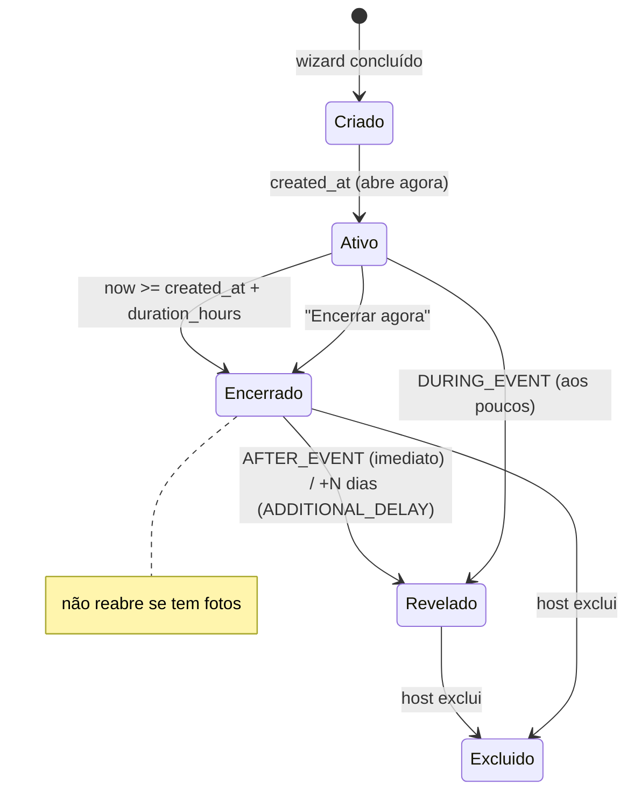
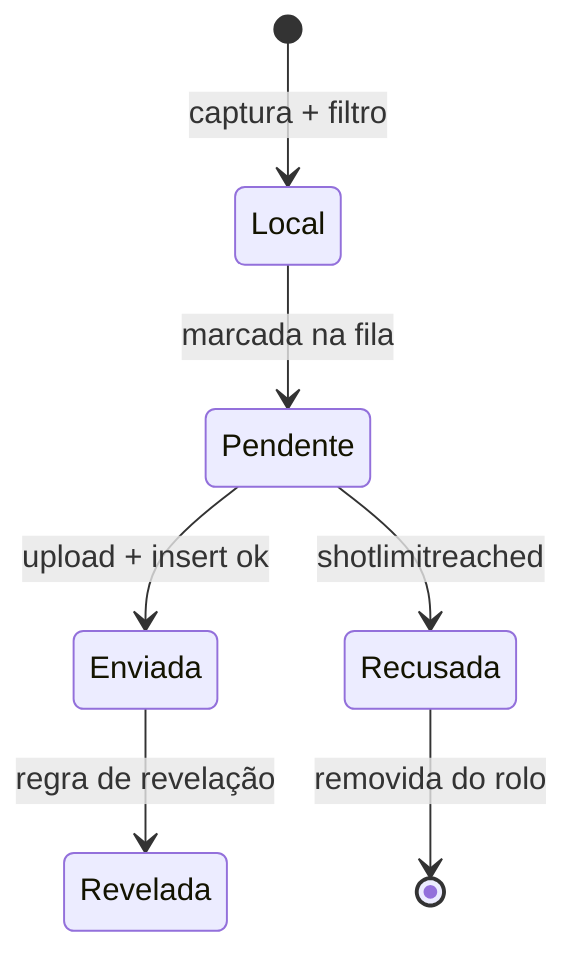
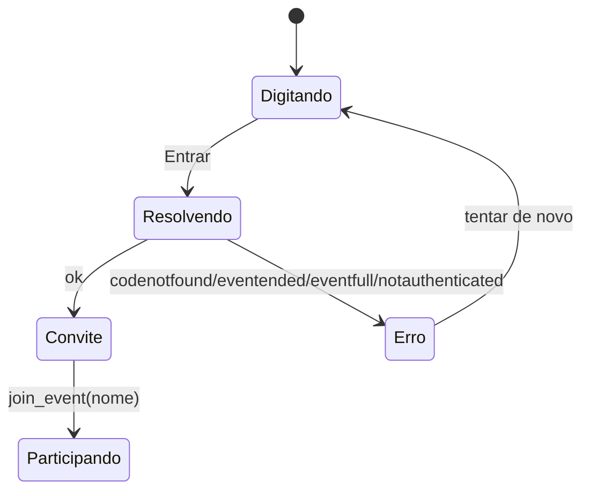

# Diagramas de estado

## Ciclo de vida do evento (EST/INF)

```mermaid
stateDiagram-v2
  [*] --> Criado: wizard concluído
  Criado --> Ativo: created_at (abre agora)
  Ativo --> Encerrado: now >= created_at + duration_hours
  Ativo --> Encerrado: "Encerrar agora"
  Encerrado --> Revelado: AFTER_EVENT (imediato) / +N dias (ADDITIONAL_DELAY)
  Ativo --> Revelado: DURING_EVENT (aos poucos)
  Revelado --> Excluido: host exclui
  Encerrado --> Excluido: host exclui
  note right of Encerrado: não reabre se tem fotos
```

## Foto (cliente)

```mermaid
stateDiagram-v2
  [*] --> Local: captura + filtro
  Local --> Pendente: marcada na fila
  Pendente --> Enviada: upload + insert ok
  Pendente --> Recusada: shotlimitreached
  Recusada --> [*]: removida do rolo
  Enviada --> Revelada: regra de revelação
```

## Entrada por código

```mermaid
stateDiagram-v2
  [*] --> Digitando
  Digitando --> Resolvendo: Entrar
  Resolvendo --> Convite: ok
  Resolvendo --> Erro: codenotfound/eventended/eventfull/notauthenticated
  Convite --> Participando: join_event(nome)
  Erro --> Digitando: tentar de novo
```
