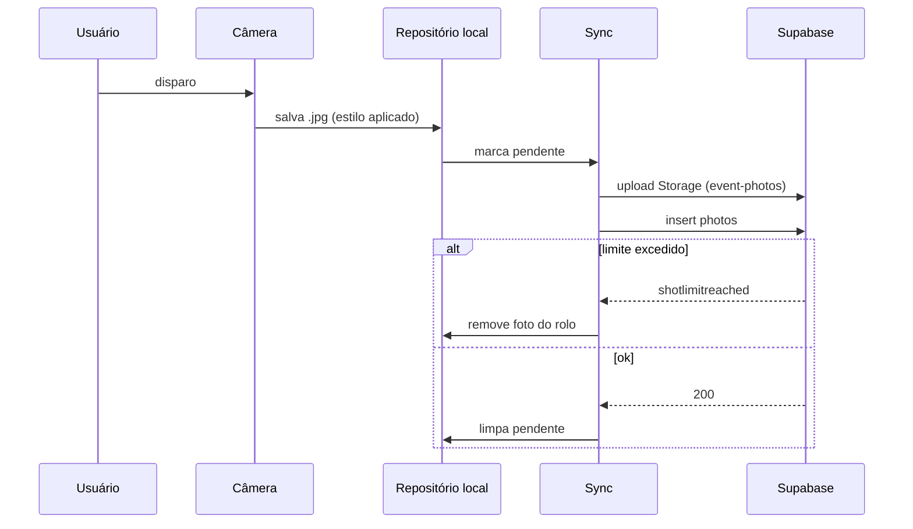

# Diagramas de jornadas

Ver `../05-NAVIGATION-MAP.md` (fluxograma de navegação) e `../04-USER-JOURNEYS.md` (jornadas). Sequência de captura/sync:

```mermaid
sequenceDiagram
  participant U as Usuário
  participant C as Câmera
  participant L as Repositório local
  participant S as Sync
  participant B as Supabase
  U->>C: disparo
  C->>L: salva .jpg (estilo aplicado)
  L->>S: marca pendente
  S->>B: upload Storage (event-photos)
  S->>B: insert photos
  alt limite excedido
    B-->>S: shotlimitreached
    S->>L: remove foto do rolo
  else ok
    B-->>S: 200
    S->>L: limpa pendente
  end
```
